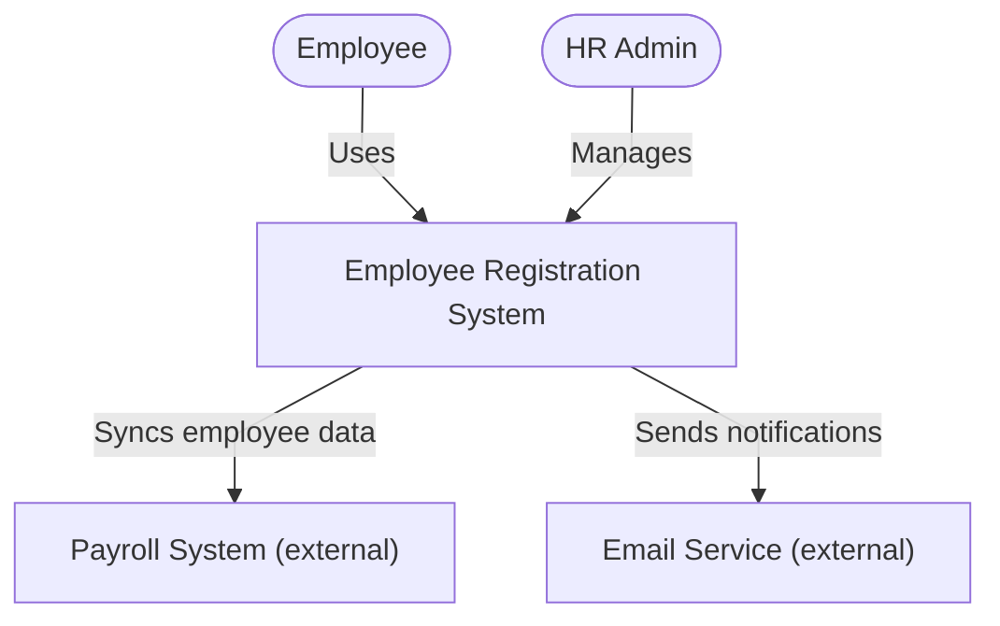
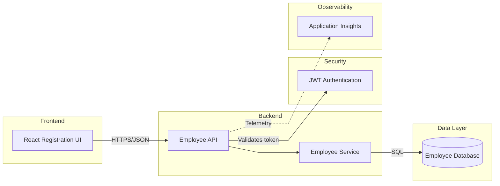
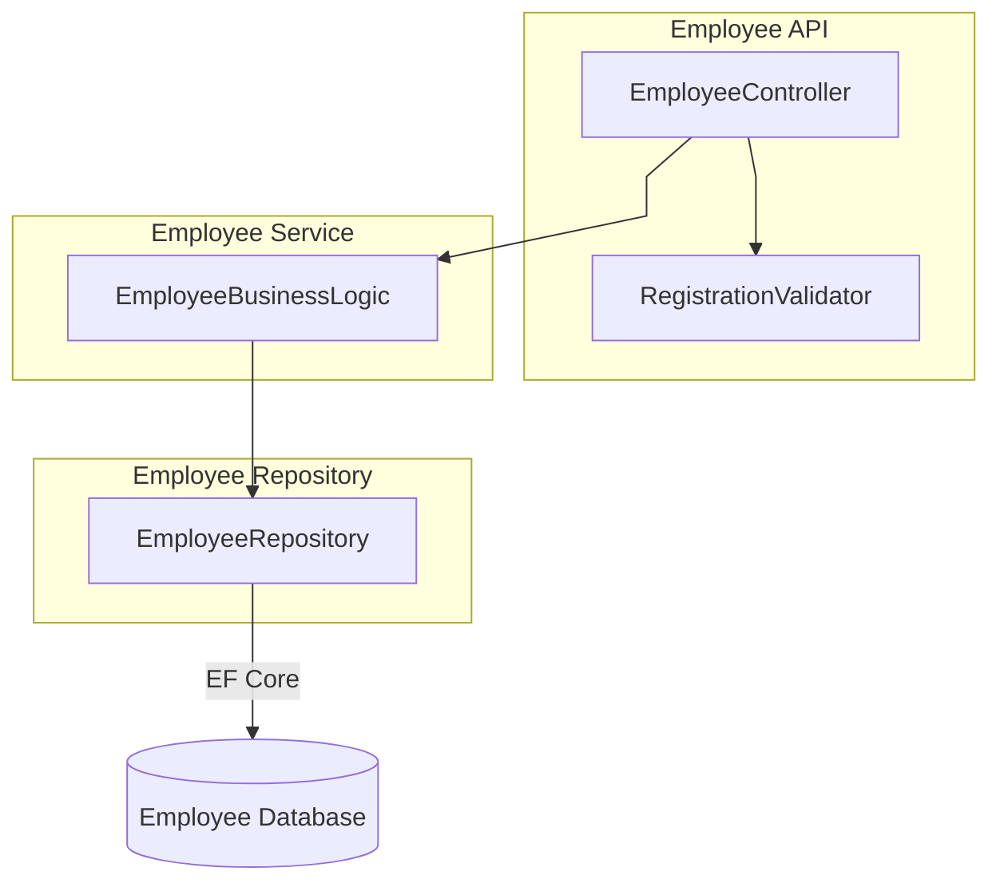
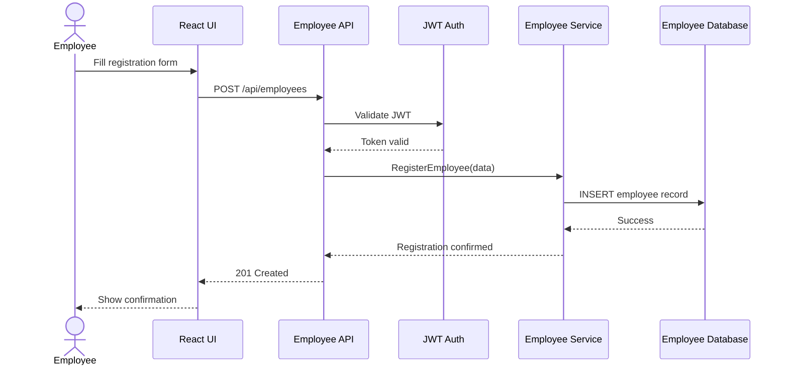
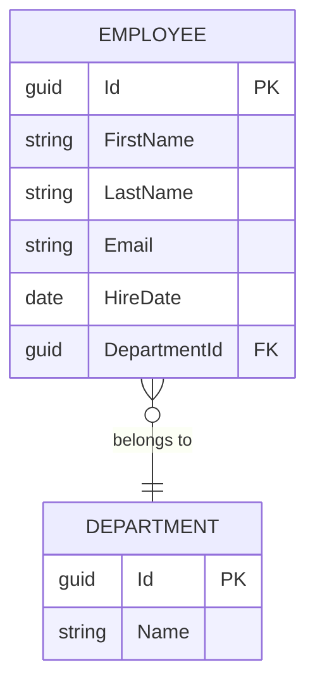

```mermaid
%%{init: {"theme":"default","securityLevel":"loose","flowchart":{"htmlLabels":true,"curve":"linear"}} }%%
flowchart TB
    subgraph Azure["Azure Subscription"]
        subgraph AppService["Azure App Service"]
            UI["React UI (Static Web App)"]
            API["Employee API"]
        end
        SQL[("Azure SQL Database")]
        KV["Azure Key Vault"]
        AI["Application Insights"]
        LA["Log Analytics"]
    end
    Users(["End Users"]) -->|HTTPS| UI
    UI -->|HTTPS/JSON| API
    API -->|TDS/SQL| SQL
    API -->|Fetch secrets| KV
    API -.->|Telemetry| AI
    AI --> LA
```

# Mermaid Architecture Diagram Generation Standards

## Purpose

Generate architecture diagrams directly from a use case's requirements source —
Epics, Features, User Stories, Acceptance Criteria, or any equivalent backlog/requirements
artifact (Azure DevOps, Jira, Confluence, a PRD, or a plain requirements doc).

The generated diagrams must represent the **actual architecture implied by the requirements**.

**Do not generate generic diagrams.** Every component, actor, data store, and flow shown
must be traceable back to a specific requirement, acceptance criterion, data need,
API need, security need, or integration mentioned in the source material.

If a requirement is ambiguous or silent on a technical detail, fall back to the
**Default Technology Stack** below rather than inventing something unrelated.

---

## Inputs

Before generating diagrams, gather:

| Input | Source | Required? |
|---|---|---|
| Use case / Epic description | Backlog tool, PRD, ticket | Yes |
| Features / Stories in scope | Backlog tool hierarchy | Yes |
| Acceptance Criteria | Story-level detail | Yes |
| Data Requirements | Stories, data dictionary | If available |
| API / Integration Requirements | Stories, integration specs | If available |
| Security / Compliance Requirements | Stories, NFRs | If available |
| Non-functional requirements (scale, latency, uptime) | Epic/NFR doc | If available |

If using a connected tool (Azure DevOps MCP, Jira MCP, etc.), pull the full hierarchy
(Epic → Features → Stories → Acceptance Criteria) before deriving components.

---

## Required Diagrams

For every use case / Epic, generate the following six diagrams, in this order:

| # | Diagram | Mermaid Type | Answers |
|---|---|---|---|
| 1 | System Context Diagram | `flowchart` (or `C4Context` if supported) | Who/what interacts with the system? |
| 2 | Solution Architecture Diagram | `flowchart` | What are the major layers/subsystems? |
| 3 | Component Diagram | `flowchart` (subgraphs) | What are the internal modules and their dependencies? |
| 4 | Sequence Diagram | `sequenceDiagram` | How does a key flow execute end-to-end? |
| 5 | Data Model Diagram | `erDiagram` | What entities exist and how do they relate? |
| 6 | Deployment Diagram | `flowchart` (subgraphs = infra boundaries) | Where does each component run? |

Skip a diagram only if the use case genuinely has nothing to show for it
(e.g., no persistent data → omit or minimally state the Data Model Diagram),
and say so explicitly rather than silently dropping it.

---

## Default Technology Stack

Use this only when the requirements do not specify a technology. Never override an
explicitly stated technology choice with these defaults.

```yaml
frontend:
  - React
  - TypeScript
backend:
  - ASP.NET Core (.NET 8) Web API
security:
  - JWT Authentication
  - Role-Based Authorization
data:
  - Azure SQL Database
observability:
  - Application Insights
  - Log Analytics
secrets:
  - Azure Key Vault
cloud:
  - Azure
deployment:
  - Azure App Service
```

---

## Diagram Generation Process

### Step 1 — Read the Requirements

Retrieve and read, in full:
- Epic / use case description
- Features
- User Stories
- Acceptance Criteria
- Any linked data, API, security, or integration requirements

If using a backlog MCP tool, call the hierarchy-fetch function (e.g. `get_work_item_hierarchy()`)
rather than reading items one at a time, so relationships between items aren't lost.

### Step 2 — Derive Architecture Components

For each Feature/Story, extract the concrete components it implies. Do not
generalize past what's stated.

**Example:**

```
Feature: Employee Registration
User Stories:
  - Create Registration Form
  - Submit Registration
  - Validate Employee Data

Produces:
  - React Registration UI
  - Employee API (controller)
  - Employee Service (business logic)
  - Employee Repository (data access)
  - Employee Database (table/schema)
  - Validation Middleware (from "Validate Employee Data")
```

### Step 3 — Build the Architecture Model

Consolidate all derived components into a structured JSON model before drawing
anything. This model is the single source of truth for all six diagrams —
every diagram should be a different projection of this same object.

```json
{
  "actors": [
    { "name": "Employee", "type": "human" },
    { "name": "HR Admin", "type": "human" }
  ],
  "external_systems": [
    { "name": "Payroll System", "protocol": "REST" }
  ],
  "frontend": [
    "Employee Registration UI"
  ],
  "backend": [
    "Employee API",
    "Employee Service"
  ],
  "database": [
    "Employee Database"
  ],
  "security": [
    "JWT Authentication",
    "Role-Based Authorization"
  ],
  "integrations": [
    "Payroll System API"
  ],
  "observability": [
    "Application Insights"
  ]
}
```

### Step 4 — Generate Diagrams from the Model

Render each of the six diagrams using the templates in the next section,
substituting the model's values. Keep node names consistent across all six
diagrams (e.g., "Employee API" must be spelled identically everywhere) so a
reader can cross-reference them.

### Step 5 — Validate

Run through the [Validation Checklist](#validation-checklist) before presenting
the output.

---

## Mermaid Rules

Always begin every diagram's code block with the same init directive, for
consistent theming:

````
```mermaid
%%{init: {"theme":"default","securityLevel":"loose","flowchart":{"htmlLabels":true,"curve":"linear"}} }%%
```
````

General conventions:
- Use `subgraph` blocks to group by architectural layer (Frontend, Backend, Data, Security, Infra).
- Use consistent node-ID casing: `PascalCase` IDs, human-readable `"Quoted Labels"`.
- Label every edge that represents a protocol or action (e.g. `-->|HTTPS/JSON|`, `-->|SQL|`).
- Keep one concern per diagram — don't cram deployment detail into the Component Diagram, etc.
- Never leave an orphan node (a node with no in/out edges) unless it is an explicitly disconnected external actor being flagged for follow-up.

---

## Diagram Templates

### 1. System Context Diagram

Shows the system as a single box, its human actors, and external systems.

````

````

### 2. Solution Architecture Diagram

Shows the major layers and how they connect.

````

````

### 3. Component Diagram

Zooms into one layer (typically backend) to show internal module dependencies.

````

````

### 4. Sequence Diagram

Shows one key end-to-end flow (pick the highest-value story, e.g. "Submit Registration").

````

````

### 5. Data Model Diagram

Shows entities and relationships derived from the Data Requirements.

````

````

### 6. Deployment Diagram

Shows where each component physically/logically runs.

````

````

---

## Naming & Styling Conventions

- **Node IDs:** `PascalCase`, no spaces (`EmployeeAPI`, not `Employee API`).
- **Node labels:** human-readable, quoted (`["Employee API"]`).
- **Databases:** always use the cylinder shape `[("Name")]`.
- **External systems/actors:** always use the stadium shape `(["Name"])`.
- **Edges:** label with protocol or verb (`-->|HTTPS|`, `-->|SQL|`, `-.->|async|`).
- **Consistency:** the same component must use the identical label across all six diagrams.

---

## Validation Checklist

Before delivering the diagrams, confirm:

- [ ] Every component in every diagram traces back to a specific requirement/story.
- [ ] No generic/placeholder components were invented without justification.
- [ ] All six diagrams use identical names for the same component.
- [ ] Every diagram starts with the required `%%{init: ...}%%` line.
- [ ] Every diagram renders without syntax errors (mentally trace each edge).
- [ ] Security requirements (auth, roles, secrets) appear in Solution Architecture and Deployment diagrams.
- [ ] Integrations/external systems appear in System Context and Sequence diagrams.
- [ ] Data requirements are fully reflected in the Data Model Diagram (fields, keys, relationships).
- [ ] Deployment targets match the stated or default cloud/hosting stack.
- [ ] Diagrams that don't apply to this use case are explicitly noted as skipped, with a one-line reason.

---

## Output Format

Present the six diagrams in order, each preceded by a one-line description of
what it shows and which requirements it derives from. Example:

```markdown
### 1. System Context Diagram
Derived from: Epic description, Feature "Employee Registration", integration with Payroll System (Story #234).

```mermaid
...
```
```

Do not add narrative filler between diagrams beyond this one-line traceability note.
